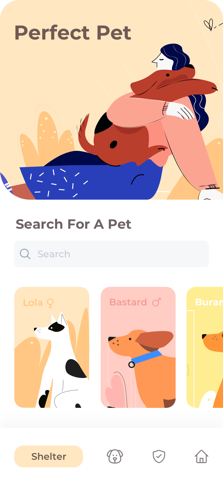

# 按钮
------

#### 前言
很多程序员似乎对颜色有种天生的不自信，认为只有通过专业的美术训练才能熟练搭配出好看的颜色。其实，在独立项目，尤其经常在缺乏设计的中后台系统开发中，只要懂得正确的使用色板便会让整个系统前台界面优雅许多。

---

## HSL vs RGB
无论对于设计师还是程序员来说，RGB / Hex 色彩会比较熟悉，设计环境默认的拾色器就是以 RGB / Hex 为基础的。而开发代码上，程序员通常也要求用 RGB  或者 Hex 值来写颜色。

但是，要方便的导出一套色彩规范，HSL 色彩算法可能更为合适。为了更好的理解后面色板的生成，这里简单普及 HSL 的一些理论知识。

- H 是 Hue 的缩写，色相
- S 是 Saturation 的缩写，饱和度
- L 是 light 的缩写，亮度

对比RGB算法，HSL 就显得比较预期可控了：设置 Hue 的值，改变饱和度或者亮度，便可以得到同一色相下的不同彩度或者亮度的变化。

---

## 单色配色色板

material design 色板

ant design 色板生成算法及工具

---

## 开始对产品进行配色
### 选择基色
无论是选择 ant design 色板生成工具还是 material design 的色板，基色一般是从一种渐变颜色的中间色号来选取。

结合单色配色方案，可以衍生出几种场景的配色

- 通常状态
- hover 状态
- 点击状态
- 淡层背景

### 辅助色
除了选择基色作为主题色，可以选择一种或几种其他颜色作为辅助色进行搭配。当然，如果对选择辅助色没有自信，可以借助 [material design 色彩检测工具](https://material.io/tools/color/#!/?view.left=0&view.right=0&primary.color=303F9F&secondary.color=4DD0E1) 来验证自己的选择。

### 语义色
语义色一般有特定的使用场景，对比多个系统色彩规范，不难看出大致有以下几种场景及配色

- 一般/通常状态
- 反馈积极的/成功状态 
- 破坏性的/失败状态
- 警告
- 提示性的/信息

当然这几种语义配色也不是固定的，例如基色已经定为红色，那么错误提示场景的颜色则需要重新选择或者采用其他设计。

### 灰色

灰色是产品中出现的最多的颜色了，它们多数用来中和界面的彩度（背景色），或是文字的主要颜色。

---

## 颜色对比度

“颜色对比度”是指显示屏上前景色与背景色之间的亮度的对比值。颜色对比度不够是程序员甚至初级设计师常犯的错误。举个例子：
##### **在亮黄色的背景上使用白色文字，或者在深色背景上使用深灰色的文字**

### WCAG2.0 标准
WCAG2.0 建议：

-  文本的视觉呈现以及文本图像至少要有4.5:1的对比度（AA级）
-  大号文本以及大文本图像至少有3:1的对比度

### 颜色对比度检查

对于没有足够界面设计经验的程序员来说，使用颜色对比度检查工具来检查选取的颜色，无疑是多了一道可靠的修正程序。

颜色对比度检查工具
[https://webaim.org/resources/contrastchecker/?fcolor=858585&bcolor=FFFFFF](https://webaim.org/resources/contrastchecker/?fcolor=858585&bcolor=FFFFFF)
[https://snook.ca/technical/colour_contrast/colour.html#fg=001F76,bg=FFACAC](https://snook.ca/technical/colour_contrast/colour.html#fg=001F76,bg=FFACAC)

---

参考资源：
[Ant Design 设计系统色彩规范](https://ant.design/docs/spec/colors-cn)
[SAP fiori 设计系统色彩规范](https://experience.sap.com/fiori-design-web/colors/)
[SAP fiori 设计系统 —— 语义颜色使用指南](https://experience.sap.com/fiori-design-web/how-to-use-semantic-colors/)
[lightning 设计系统 —— 颜色命名规范](https://www.lightningdesignsystem.com/design-tokens/#category-color)
[Web内容无障碍指南 (WCAG) 2.0](https://www.w3.org/Translations/WCAG20-zh/)

