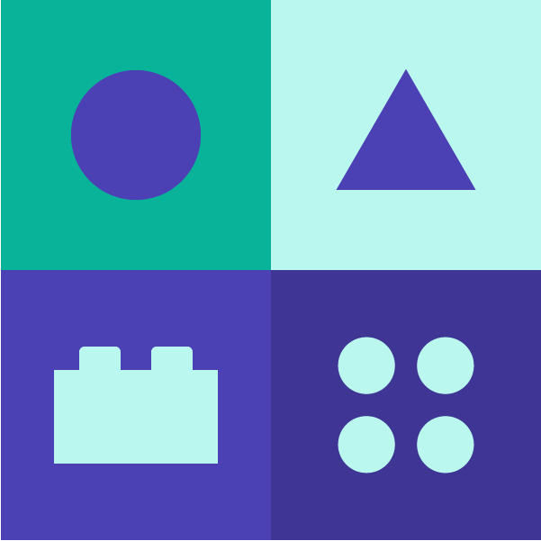
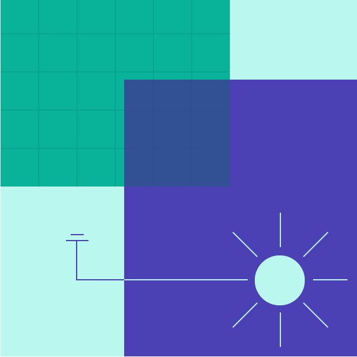

# 设计准则 Design Principles

开发者或设计师在使用 Alpha Design System 时应参考以下设计准则，以保证最终呈现的产品质量和用户体验。

-----

    
    

        <h3>Simplicity 简单</h3>
       
设计者应该精简 UI 组件，提供有限的选择并建立更智能的默认状态。如同乐高，使用最简单的模块，即可组合排列出复杂的形态。隐藏非频繁访问的信息或元件，只在需要的时候显示它们。

    

    
    

        <h3>Clarity 清晰</h3>
       
设计者应该关注更合理的信息层级组织方式，善于利用视觉的对比和继承，使产品始终传达清晰易懂的信息及动作。

    

    
    

        <h3>Elegance 优雅</h3>
       
保持一致的视觉设计语言，善用动画和微交互为产品赋予用户操作上的愉悦体验。

    

